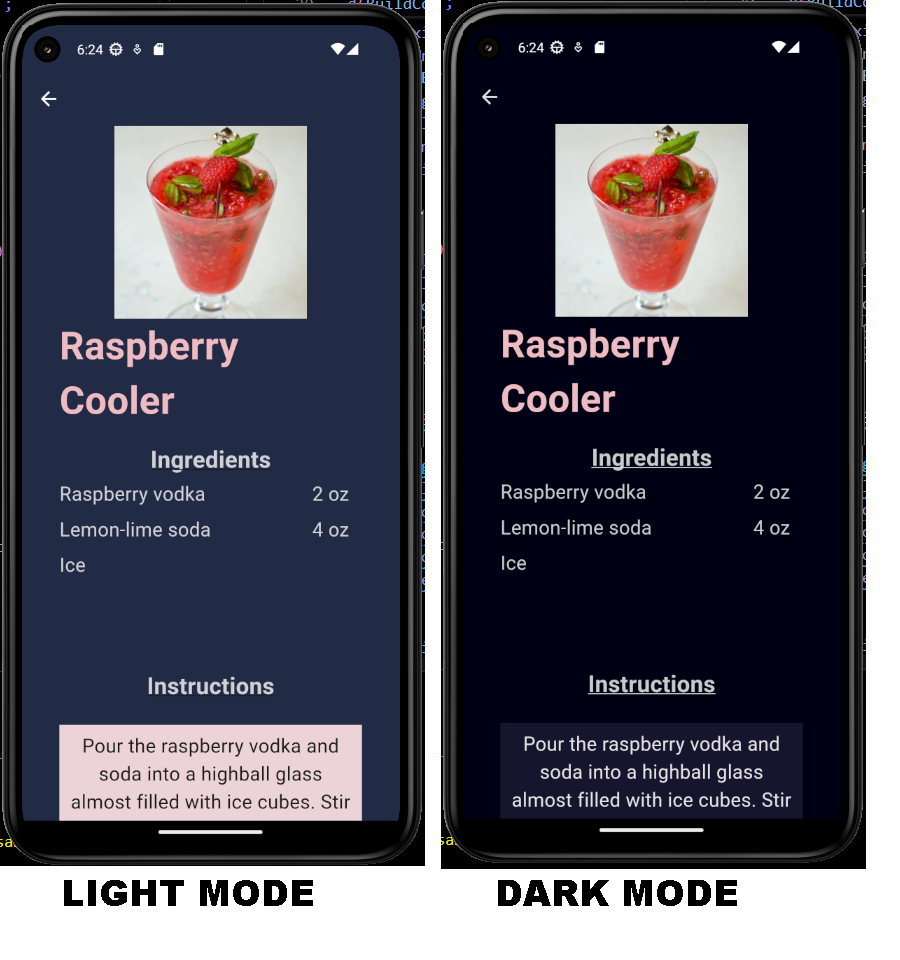
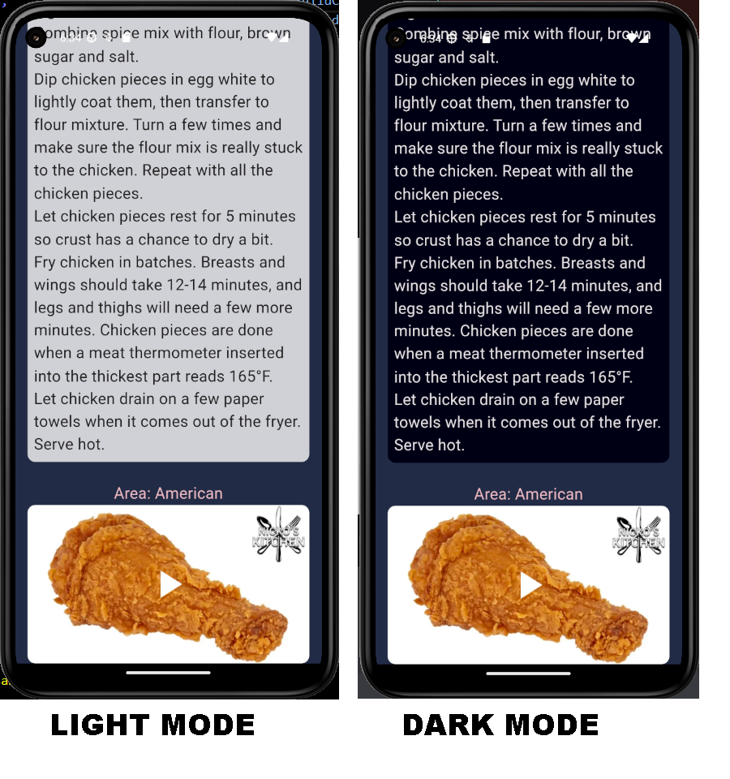

# Flutter App Meals & Drinks

Esta aplicación como proyecto evaluativo para la materia Laboratorio de Computación IV, de la TUP. UTN FRBB. 

## Tabla de Contenidos

-  [Consideraciones](#consideraciones)
-  [Herramientas](#herramientas)
-  [Funcionalidades](#funcionalidades)
-  [Pantallas](#pantallas)
-  [Autoras](#autoras)
-  [Reconocimientos](#reconocimientos)

### Consideraciones
Esta aplicación se desarrolló sobre la premisa de que debia consumir datos de una API desarrollada previamente  [(repositorio de la API)](https://github.com/marciabel/api-express). 
Dicha API, al consumir de una tercera parte, _**puede demorar un poco en responder y esto puede afectar los tiempos de carga**_ de las pantallas de Drinks y de Meals, ya que debe esperar la respuesta de la API.

Además, fue desarrollada en inglés, porque los datos que obteníamos de dicha API estaban en ese idioma y mantuvimos la consistencia en cómo se presenta la información. 

Respecto del diseño de la interfaz, se utilizaron diferentes opciones para mostrar los registros, y tener la posibilidad de trabajar con diferentes Widgets. 

### Herramientas 

Se utilizó Flutter y se desarrolló en VS Code. 
Se testeó en los siguientes modelos de celulares: 
- Pixel API 33/34: Resolution (px): 1080 x 1920 | Resolution (dp): 412 x 732
- Pixel 5 API 33/34: Resolution (px): 1080 x 2340 | Resolution (dp): 393 x 851

También se testeo corriendolo en Chrome, pero en este caso no esta mostrando la imagen del inicio. Tampoco acepta el reproductor de video que tiene la pantalla de Meal Detail. 

### Funcionalidades
Desde la app se puede acceder a dos secciones, una de 'Meals' y otra de 'Drinks'.

**Drinks:** Provee un listado de tragos, a los cuales se puede ingresar y obtener más detalles de cada uno respecto a ingredientes e instrucciones de preparación. Además se pueden likear ciertos tragos como una funcionalidad extra. 
**Meals:** Provee un listado de platillos, a los cuales se puede ingresar y obtener más detalles. Allí se podrá ver las instrucciones, junto con un video de Youtube donde se explica la receta.

En esta versión **se incluyo el uso de temas para la UI**. Desde el menú que se encuentra sobre la esquina superior izquierda (ver imagen en la sección de [Pantallas](#pantallas)), puede usarse un boton de toggle que permite cambiar entre el modo 'Light' y el modo 'Dark' para toda la aplicación. 

### Pantallas
**Home y Drawer**

**Drinks**

**Meals**

### Autoras

 - Alvarez, Marcia Belen 
 - Dominguez Fernandez, Pamela Victoria

### Reconocimientos

Se ha utilizado una paleta de colores extraída de happyhues. [Paleta de colores](https://www.happyhues.co/palettes/12)  

Se han realizado consultas a dos APIs para consultar y construir los diferentes endpoints que forman la **API Meals & Drinks.**, y de los cuales obtuvimos los datos para mostrar:

 - [https://www.thecocktaildb.com/](https://www.thecocktaildb.com/api.php)  
 - [https://www.themealdb.com/](https://www.themealdb.com/api.php)  
